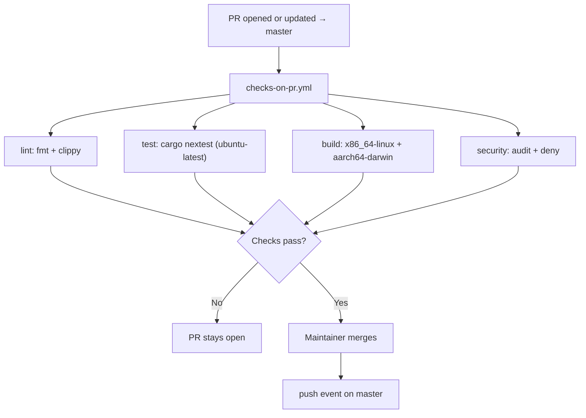
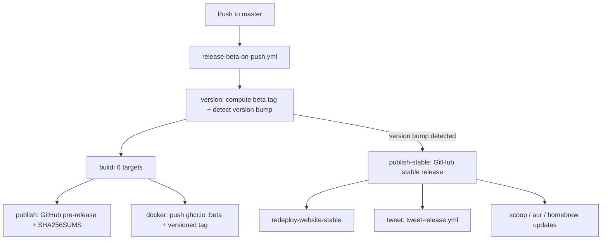
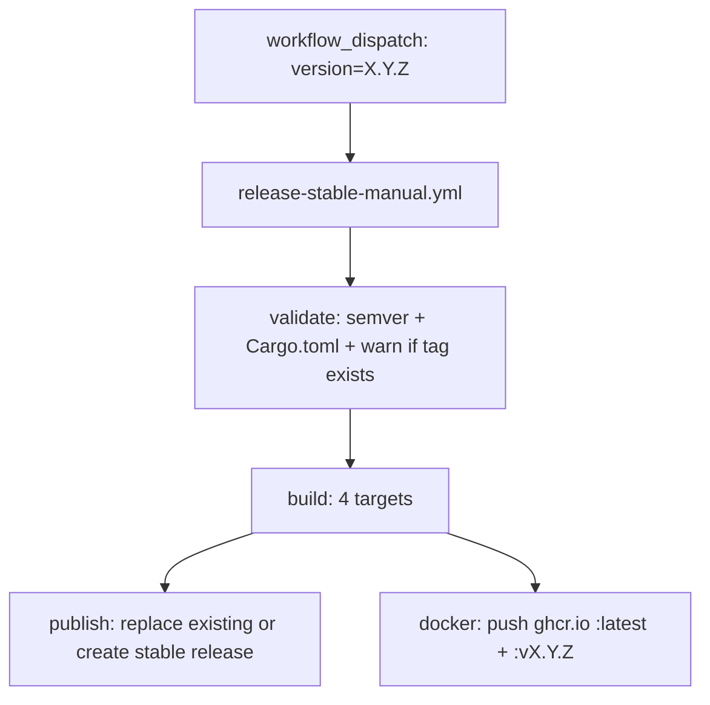

# Master Branch Delivery Flows

This document explains what runs when code is proposed to `master` and released.

Use this with:

- [`docs/ci-map.md`](../../docs/contributing/ci-map.md)
- [`docs/pr-workflow.md`](../../docs/contributing/pr-workflow.md)
- [`docs/release-process.md`](../../docs/contributing/release-process.md)

## Branching Model

ZeroClaw uses a single default branch: `master`. All contributor PRs target `master` directly. There is no `dev` or promotion branch.

Current maintainers with PR approval authority: `theonlyhennygod`, `JordanTheJet`, and `SimianAstronaut7`.

## Active Workflows

| File | Trigger | Purpose |
| --- | --- | --- |
| `checks-on-pr.yml` | `pull_request` → `master` | Lint + test + build + security audit on every PR |
| `cross-platform-build-manual.yml` | `workflow_dispatch` | Full platform build matrix (manual) |
| `release-beta-on-push.yml` | `push` → `master` | Beta release on every master commit; **auto stable release + post-publish on version bumps** |
| `release-stable-manual.yml` | `workflow_dispatch` | Stable release fallback (manual, version-gated) |

## Event Summary

| Event | Workflows triggered |
| --- | --- |
| PR opened or updated against `master` | `checks-on-pr.yml` |
| Push to `master` (including after merge) | `release-beta-on-push.yml` |
| Manual dispatch | `cross-platform-build-manual.yml`, `release-stable-manual.yml` |

## Step-By-Step

### 1) PR → `master`

1. Contributor opens or updates a PR against `master`.
2. `checks-on-pr.yml` starts:
   - `lint` job: runs `cargo fmt --check` and `cargo clippy -D warnings`.
   - `test` job: runs `cargo nextest run --locked` on `ubuntu-latest` with Rust 1.92.0 and mold linker.
   - `build` job (matrix): compiles release binary on `x86_64-unknown-linux-gnu` and `aarch64-apple-darwin`.
   - `security` job: runs `cargo audit` and `cargo deny check licenses sources`.
   - Concurrency group cancels in-progress runs for the same PR on new pushes.
3. All jobs must pass before merge.
4. Maintainer (`theonlyhennygod`, `JordanTheJet`, or `SimianAstronaut7`) merges PR once checks and review policy are satisfied.
5. Merge emits a `push` event on `master` (see section 2).

### 2) Push to `master` (including after merge)

1. Commit reaches `master`.
2. `release-beta-on-push.yml` (Release Beta) starts:
   - `version` job: computes beta tag as `v{cargo_version}-beta.{run_number}`.
   - `build` job (matrix, 4 targets): `x86_64-linux`, `aarch64-linux`, `aarch64-darwin`, `x86_64-windows`.
   - `publish` job: generates `SHA256SUMS`, creates a GitHub pre-release with all artifacts. Artifact retention: 7 days.
   - `docker` job: builds multi-platform image (`linux/amd64,linux/arm64`) and pushes to `ghcr.io` with `:beta` and the versioned beta tag.
3. This runs on every push to `master` without filtering. Every merged PR produces a beta pre-release.
4. **If the push is a version bump** (Cargo.toml version changed from prior commit):
   - `publish-stable` job: creates a stable (non-prerelease) GitHub Release with the `vX.Y.Z` tag. Replaces any existing release with that tag.
   - `redeploy-website-stable` job: triggers website redeploy via repository dispatch.
   - `tweet` job: calls `tweet-release.yml` to post the release announcement on X.
   - `scoop` / `aur` / `homebrew` jobs: call their respective reusable workflows to update package manager manifests.

### 3) Stable Release (manual fallback)

> **Note:** This workflow now serves as a **fallback**. Version bump pushes to master automatically trigger stable releases via `release-beta-on-push.yml`. Use this workflow when you need to manually re-release or if the automated path failed.

1. Maintainer runs `release-stable-manual.yml` via `workflow_dispatch` with a version input (e.g. `0.2.0`).
2. `validate` job checks:
   - Input matches semver `X.Y.Z` format.
   - `Cargo.toml` version matches input exactly.
   - If tag `vX.Y.Z` already exists, it warns and replaces the existing release (no longer fails hard).
3. `build` job (matrix, same 4 targets as beta): compiles release binary.
4. `publish` job: generates `SHA256SUMS`, creates a stable GitHub Release (not pre-release). Artifact retention: 14 days.
5. `docker` job: pushes to `ghcr.io` with `:latest` and `:vX.Y.Z`.

### 4) Full Platform Build (manual)

1. Maintainer runs `cross-platform-build-manual.yml` via `workflow_dispatch`.
2. `build` job (matrix, 3 targets): `aarch64-linux-gnu`, `x86_64-darwin` (macOS 15 Intel), `x86_64-windows-msvc`.
3. Build-only, no tests, no publish. Used to verify cross-compilation on platforms not covered by `checks-on-pr.yml`.

## Build Targets by Workflow

| Target | `checks-on-pr.yml` | `cross-platform-build-manual.yml` | `release-beta-on-push.yml` | `release-stable-manual.yml` |
| --- | :---: | :---: | :---: | :---: |
| `x86_64-unknown-linux-gnu` | ✓ | | ✓ | ✓ |
| `aarch64-unknown-linux-gnu` | | ✓ | ✓ | ✓ |
| `aarch64-apple-darwin` | ✓ | | ✓ | ✓ |
| `x86_64-apple-darwin` | | ✓ | | |
| `x86_64-pc-windows-msvc` | ✓ | ✓ | ✓ | ✓ |

## Mermaid Diagrams

### PR to Master

### Beta Release (on every master push) + Auto Stable on Version Bump

### Stable Release (manual fallback)

## Quick Troubleshooting

1. **Quality gate failing on PR**: check `lint` job for formatting/clippy issues; check `test` job for test failures; check `build` job for compile errors; check `security` job for audit/deny failures.
2. **Beta release not appearing**: confirm the push landed on `master` (not another branch); check `release-beta-on-push.yml` run status.
3. **Stable release failing at validate**: ensure `Cargo.toml` version matches the input version. Existing tags are now handled gracefully (warn + replace).
4. **Full matrix build needed**: run `cross-platform-build-manual.yml` manually from the Actions tab.
